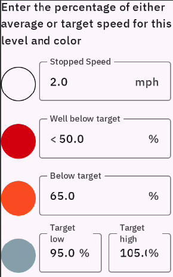
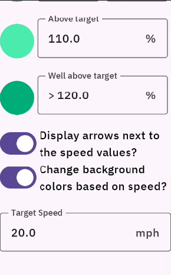
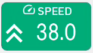
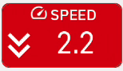
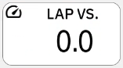
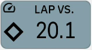

# Karoo Color Speed Extension

A speed field that changes color based on current speed vs. ride or average speed.

|  | |
| :------- | :------: |
|    | 
|    |   |
|    |   |

## Features
- Current vs. ride average
- Current vs. last lap average
- Current lap average vs. last lap average
- Current speed vs. target speed
- Lap speed vs. target speed

## Requirements
- Karoo (tested on last Karoo ) with version 1.527 or later

## Installation

You can sideload the app using the following steps for Karoo 2

1. Download the APK from the releases .
1. Prepare your Karoo for sideloading by following the [step-by-step guide](https://www.dcrainmaker.com/2021/02/how-to-sideload-android-apps-on-your-hammerhead-karoo-1-karoo-2.html) by DC Rainmaker.
1. Install the app using the command `adb install app-release.apk`.
1. **Reboot your Karoo**

If you've Karoo 3 and v > 1.527 you can sideload the app using the following steps:

1. Share the apk link from the [releases page](https://github.com/currand/karoo-colorspeed/releases) with Hammerhead companion app
2. Install the app using the Hammerhead companion app.
3. Reboot the Karoo

